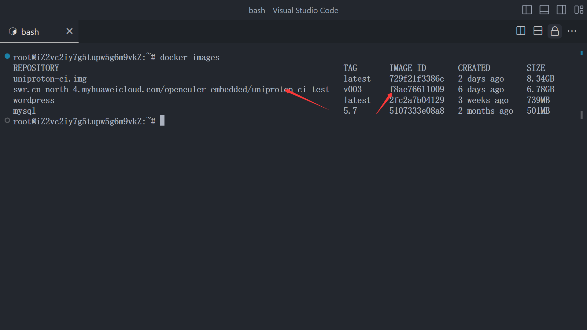
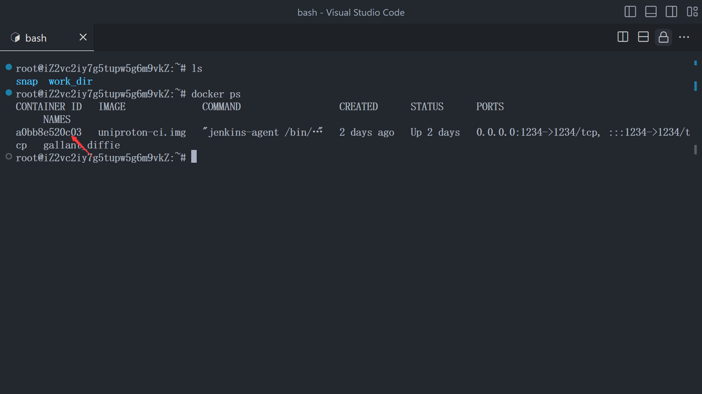
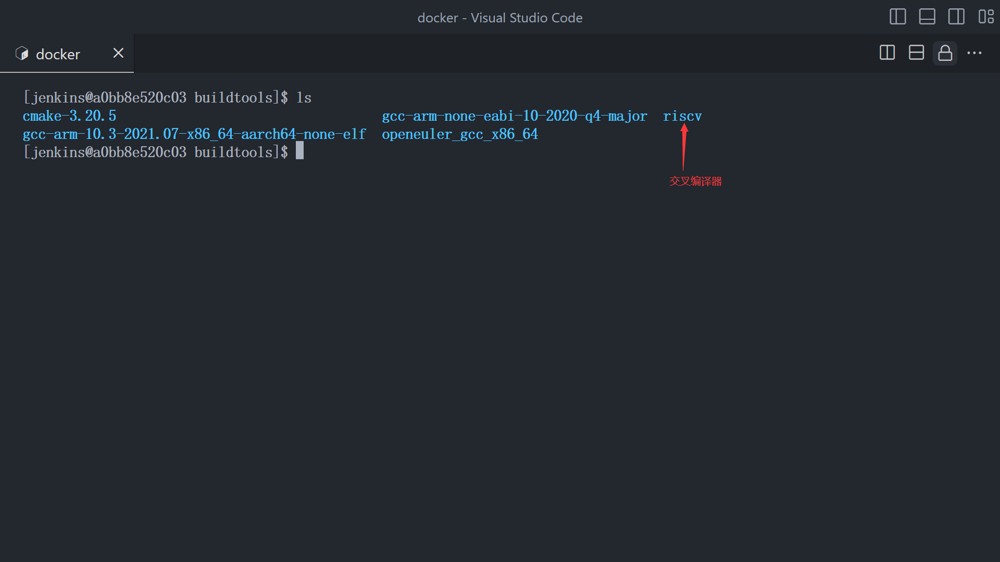
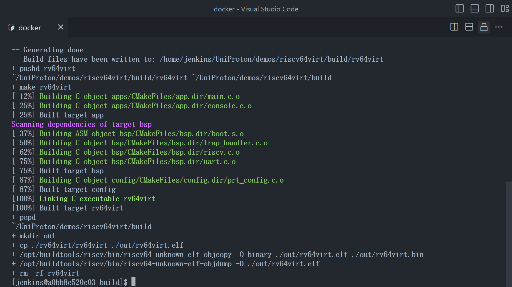

## qemu-system-riscv64上运行 UniProton

## docker镜像的方式 [推荐, 和CI 的环境保持一致]

**注 : 此处以 ubuntu 举例说明使用方式** 

-  [安装 docker](https://zhuanlan.zhihu.com/p/651148141) 

-  拉取包含UniProton环境的镜像

  - ```shell
    docker pull swr.cn-north-4.myhuaweicloud.com/openeuler-embedded/uniproton-ci-test:v003
    ```

- 使用 `docker images` 查看拉取的镜像，比如我这里是这样的

  - 

- 使用 `docker run` 创建镜像的容器

  - 比如我这里使用的应该是 

    ```shell
    docker run -itd f8ae76611009 /bin/bash
    ```

  - 其中 `f8ae76611009` 是镜像id

  - -d   是在后台运行 

  -  -i   是允许你对容器内的标准输入 (STDIN) 进行交互

  -  -t   是在新容器内指定一个伪终端或终端

  - 启动后使用 `docker ps ` 应该能够看到自己的容器以及对应的ID

  - 

- 使用 `docker exec -it [容器ID] /bin/bash` 连上 docker 容器

  - 比如我这里应该使用

    ```shell
    docker exec -it a0bb8e520c03 /bin/bash
    ```

  - 连上后，进入目录 `/opt/buildroot`, 可以观察到一系列 UniProton 编译依赖的软件

  - 

  - 其中 `riscv` 为交叉编译器

  - `cmake-3.20.5` 为 CMake软件

  - **注意 ： 此处不应当对这些软件进行任何修改，包括重命名，移动目录所在的位置等操作**

  - 用 `qemu-system-riscv64 --version` 检查当前环境是否存在qemu-system-riscv64 且版本应当为 7.2.0

  - 若想要退出 docker 环境，执行 `exit` 即可

- 编译UniProton  riscv demo

  - 拉取仓库代码到本地 [此处可以在任意目录下拉取 建议在家目录下拉取]

    ```shell
    git clone https://gitee.com/openeuler/UniProton.git
    ```

  - 进入UniProton demo 目录

    ```shell
    cd UniProton/demos/riscv64virt/
    ```

  - 进入 demo 的 build目录

    ```shell
    cd build
    ```

  - 执行构建

    ```shell
    sh -x -e build_app.sh
    ```

  - 如果在过程中发现没有输出日志这是正常的，比如出现下面的情况

  - 

  - 这是由于过程的日志被重定向到文件了，并不会输出到屏幕

  - 执行完毕后，我的构建结果如下

  - 

- 使用qemu-system-riscv64 运行 编译完成的DEMO

  - 构建完成后，应该会在 `build目录`中出现 `out目录`

  - 进入 out 目录

    ```shell
    cd out
    ```

  - 发现文件 rv64virt.asm,rv64virt.bin 和 rv64virt.elf，分别对应内核汇编代码，BIN文件和ELF文件

  - 我们使用qemu 加载 ELF文件

    ```shell
    qemu-system-riscv64 -bios none -M virt -m 512M  -nographic -kernel rv64virt.elf -smp 1
    ```

  - 注： 此处参数需要额外注意

    -  -smp 1               ->   RTOS是不支持多核的，这可能已经是业界规定? 【目前看到的所有RTOS都不支持多核，除非自己做多核的临界区管理】
    -  -bios none         ->   不支持S模式， 去除OPENSBI 加载
    -  -M virt                 ->   对应的机器应该为VIRT 机器
    -  -m 512M             ->   对应的内存应该 >=512M ，否则会出现一些由于内存分配导致的问题

- demo初步试探

  - 以任意你喜欢的形式试探 shell demo

## 本机方式